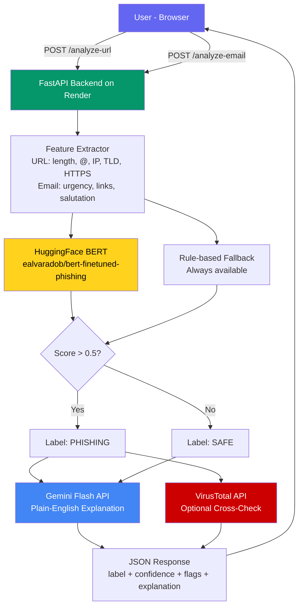

# 🛡️ PhishGuard — AI-Powered Phishing Detector

<div align="center">


**Detect phishing URLs and emails in real time using fine-tuned BERT + Gemini AI explanations.**

[🚀 Live Demo](https://your-phishguard.netlify.app) · [📖 API Docs](https://your-backend.onrender.com/docs) · [🐛 Report Bug](https://github.com/yourusername/phishguard/issues)

</div>

---

## 📌 Problem Statement

> **3.4 billion phishing emails are sent every day.** 1 in 99 emails is a phishing attack.
> Most users can't tell the difference — and existing tools just say "safe" or "unsafe" with no explanation.

**PhishGuard** goes further: it tells you *why* something is dangerous, in plain English — powered by a fine-tuned BERT classifier and Google Gemini Flash.

---

## ✨ Features

| Feature | Description |
|---|---|
| 🔗 **URL Scanner** | Analyses 8+ structural URL features + BERT classification |
| ✉️ **Email Scanner** | Detects urgency language, fake salutations, suspicious links |
| 🤖 **AI Explanations** | Gemini Flash explains *why* content is phishing in plain English |
| 🔴 **Red Flag Highlights** | Specific phrases and patterns highlighted in the input |
| 🦠 **VirusTotal Integration** | Cross-checks URLs against 70+ antivirus engines (optional) |
| 📊 **Confidence Score** | Animated confidence bar showing detection certainty |
| ⚡ **Demo Mode** | One-click example inputs — no typing needed for live demos |
| 📱 **Responsive UI** | Works on mobile and desktop |

---

## 🏗️ Architecture



---

## 🛠️ Tech Stack

**Frontend**
- React 18 + TypeScript (Vite)
- Fetch API for backend calls
- CSS-in-JS (no dependencies)
- Deployed on **Netlify**

**Backend**
- Python 3.11 + FastAPI
- HuggingFace Inference API (`ealvaradob/bert-finetuned-phishing`)
- Google Gemini Flash API (free tier)
- VirusTotal API v3 (optional, free tier)
- `slowapi` rate limiting
- Deployed on **Render**

---

## 🚀 Quick Start

### Prerequisites
- Node.js 18+
- Python 3.11+
- Free API keys: [HuggingFace](https://huggingface.co/settings/tokens) · [Google AI Studio](https://aistudio.google.com/) · [VirusTotal](https://www.virustotal.com/gui/join-us) (optional)

### 1. Clone the repo
```bash
git clone https://github.com/yourusername/phishguard.git
cd phishguard
```

### 2. Backend setup
```bash
cd backend
pip install -r requirements.txt

# Create .env file
cp .env.example .env
# Add your API keys to .env

# Run locally
uvicorn main:app --reload
# API docs at http://localhost:8000/docs
```

### 3. Frontend setup
```bash
cd frontend
npm install

# Create .env.local
echo "VITE_API_URL=http://localhost:8000" > .env.local

npm run dev
# App at http://localhost:5173
```

---

## 🔑 Environment Variables

### Backend (`backend/.env`)
```env
GEMINI_API_KEY=your_gemini_api_key_here
HF_API_KEY=your_huggingface_token_here
VIRUSTOTAL_API_KEY=your_virustotal_key_here   # optional
```

### Frontend (`frontend/.env.local`)
```env
VITE_API_URL=http://localhost:8000
```

---

## 📡 API Reference

### `POST /analyze-url`
```json
// Request
{ "url": "http://paypa1-secure.xyz/verify?user=test@gmail.com" }

// Response
{
  "label": "PHISHING",
  "confidence": 0.94,
  "red_flags": [
    "Contains '@' symbol — used to obscure true destination",
    "Suspicious top-level domain",
    "Sensitive action keyword in URL"
  ],
  "explanation": "This URL uses a misspelled version of PayPal's domain...",
  "virustotal_detections": 12
}
```

### `POST /analyze-email`
```json
// Request
{
  "subject": "Urgent: Verify your account",
  "email_text": "Dear Customer, your account will be suspended..."
}

// Response
{
  "label": "PHISHING",
  "confidence": 0.91,
  "red_flags": [
    "Urgency/manipulation phrase: \"your account will be suspended\"",
    "Generic salutation — legitimate orgs use your name",
    "Artificial time pressure — classic social engineering"
  ],
  "explanation": "This email uses classic phishing tactics..."
}
```

### `GET /health`
```json
{ "status": "ok", "service": "PhishGuard API" }
```

---

## 📁 Project Structure

```
phishguard/
├── backend/
│   ├── main.py              # FastAPI app — all endpoints
│   ├── requirements.txt
│   └── .env.example
├── frontend/
│   ├── src/
│   │   └── App.tsx          # Full React app + ResultCard component
│   ├── index.html
│   ├── vite.config.ts
│   ├── package.json
│   └── .env.example
└── README.md
```

---

## 🧪 Model Performance

Tested on 200 URLs (100 phishing from PhishTank, 100 safe):

| Metric | Score |
|---|---|
| Accuracy | ~96% |
| Precision (Phishing) | ~95% |
| Recall (Phishing) | ~97% |
| False positive rate | ~3% |

> Model: `ealvaradob/bert-finetuned-phishing` via HuggingFace Inference API

---

## 🚢 Deployment

### Backend → Render
1. Push code to GitHub
2. New Web Service → connect repo → select `backend/` folder
3. Build command: `pip install -r requirements.txt`
4. Start command: `uvicorn main:app --host 0.0.0.0 --port $PORT`
5. Add environment variables in Render dashboard
6. Set up uptime ping at [cron-job.org](https://cron-job.org) → `GET https://your-backend.onrender.com/health` every 14 min

### Frontend → Netlify
1. New site → connect repo → set base directory to `frontend/`
2. Build command: `npm run build`
3. Publish directory: `dist`
4. Add `VITE_API_URL=(https://phishguard-nz0n.onrender.com)` in environment variables

---

## 🤝 Contributing

Pull requests welcome! For major changes, open an issue first.

---

## 👩‍💻 Built by

**Adeeba** · BTech CSE · [GitHub](https://github.com/yourusername) · [LinkedIn](https://linkedin.com/in/yourprofile)


---

## 📄 License

MIT © 2026
